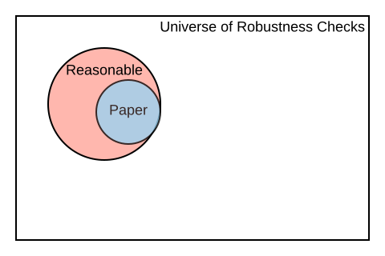
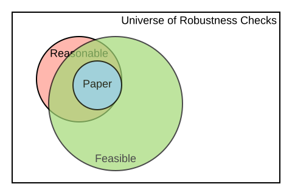

background-image: url("Images/BITSSlogo.png"), url(Images/cega.png)
background-size: contain, 200px
background-position: 50% 100% , 100% 10% 
count:true 

#[BITSS](https://bitss.org)   

<style>

.center2 {
  margin: 0;
  position: absolute;
  top: 50%;
  left: 50%;
  -ms-transform: translate(-50%, -50%);
  transform: translate(-50%, -50%);
}


pre.sourceCode {
    max-height: 200px;
    overflow-y: auto;
}


/*
.remark-slide-number {
  position: inherit;
}

.remark-slide-number .progress-bar-container {
  position: absolute;
  bottom: 0;
  height: 4px;
  display: block;
  left: 0;
  right: 0;
}

.remark-slide-number .progress-bar {
  height: 100%;
  background-color: blue;
}
*/
</style>


```{css, echo=FALSE}
# CSS for including pauses in printed PDF output (see bottom of lecture)
@media print {
  .has-continuation {
    display: block !important;
  }
}

```


```{r setup, include=FALSE}
options(htmltools.dir.version = FALSE)
library(knitr)
opts_chunk$set(
  fig.align="center",  
  fig.height=4, #fig.width=6,
  # out.width="748px", #out.length="520.75px",
  dpi=300, #fig.path='Figs/',
  cache=T ,#, 
  echo=F #warning=F, message=F
  )
library(tidyverse)
library(hrbrthemes)
library(fontawesome)
library(kableExtra)

```


.pull-left[
The Berkeley Initiative for Transparency in the Social Sciences works to improve </br>the credibility of science by </br>
advancing transparency, </br> reproducibility,  rigor, and </br> ethics in research. 

.font130[**Core ACRe**]
  

 Aleks Bogdanoski  
 
 Albert Chae

 Fernando Hoces  de la Guardia
 
 Katie Hoeberling  

Edward Miguel
 
Lars Vilhuber
 
]
.pull-right[ .right[
We are part of the Center for Effective Global Action ([CEGA](https://cega.berkeley.edu/)).   
 </br></br></br></br></br></br></br>


.font130[**Many Others**]

CEGA staff

Undergrad and Graduate RAs

Catalysts

Outside Collaborators   
(Researchers, Programmers)
  ]]
 


---

# Table of Contents 

<br><br>
.font160[
1. [Motivation](#motivation)

2. [**A**ccelerating **C**omputational **Re**producibility: Framework](#acre)

3. [ACRe Resources for Teaching Reproducibility in the Classroom: Demo](#demo)

]

---
count:false
name:motivation
# Table of Contents 

<br><br>
.font160[
1. [**Motivation**](#motivation)

2. [**A**ccelerating **C**omputational **Re**producibility: Framework](#acre)

3. [ACRe Resources for Teaching Reproducibility in the Classroom: Demo](#demo)

]

---

# .font100[Motivation 1: Low Replicability and Reproducibility]
</br>

.font180[
| Replication in Social Sciences<br>(same method, different sample) 	| Reproduction in Economics<br>(same data and methods) 	|
|-------------------------------------------------------------------	|------------------------------------------------------	|
| OSC ([2015](https://docs.google.com/document/d/1mm_4HZnEz_2Bh8XuiS2tpqCH08MFPyqUhi1baKPqR8Y/edit#heading=h.7vqf2cziid7z)): 30%-60%                      	                          | Chang & LiRobustness ([2015](https://www.nowpublishers.com/article/Details/CFR-0053)): 43%                               	|
| Camerer et. al. ([2016](https://science.sciencemag.org/content/351/6280/1433)): ~60%                                      	| Gertler et. al. ([2017](https://www.nature.com/articles/d41586-018-02108-9)): 14%                          	|
| Nosek & Camerer et. al. ([2018](https://www.nature.com/articles/s41562-018-0399-z)): ~60%                              	| Kingi et. al. ([2018](https://hautahi.com/static/docs/Replication_aejae.pdf)): 43%                            	|
| Klein et. al. ([2018](https://journals.sagepub.com/doi/10.1177/2515245918810225)): 50%                                         	| Wood et. al. ([2018](https://journals.plos.org/plosone/article?id=10.1371/journal.pone.0209416#abstract0)): 25%                             	|
]


---


# .font90[Motivation 2: More Inclusive Concept Scholarly Output]     
.font120[
In addition to reproducibility problems, there are two additional motivations for this projects:   
] 

.font120[
    <blockquote>
    Clarebout Principle:
    </br></br>
    “An article about computational science in a scientific publication is not the scholarship itself, it’s merely scholarship advertisement. The actual scholarship is the complete software development environment and the complete set of instructions which generated the figures.”
</br></br>    
.right[  <cite> Buckheit and D.L. Donoho (1995, [2009](https://academiccommons.columbia.edu/doi/10.7916/D8QZ2MDS/download))</cite> ]
    </blockquote>
]

---

# .font90[Motivation 2: More Inclusive Concept Scholarly Output]     

.font120[
In addition to reproducibility problems, there are two additional motivations for this projects:   
] 


.font120[
    <blockquote>
    Clarebout Principle:
    </br></br>
    “An <b>article</b> about computational science in a scientific publication is not the scholarship itself, <b>it’s merely scholarship advertisement</b>. The actual <b>scholarship is the complete software development environment and the complete set of instructions which generated the figures</b>.”
</br></br>    
.right[  <cite> Buckheit and D.L. Donoho (1995, [2009](https://academiccommons.columbia.edu/doi/10.7916/D8QZ2MDS/download))</cite> ]
    </blockquote>
]

--

.font120[
  .pull-left[
  
  Well discussed potential positive effects on:
  - Pedagogy  
  - Incremental generation of knowledge 
  ]
]
--
.font120[
  .pull-right[
  Under discussed:
  
  - Possible positive effect on diversity, equity and inclusion: no connections or language skills ("appropriate politeness") required to obtain materials 
  ]
]
???
An under discussed benefit of this principle is that increases access to knowledge for students who are outside of elite schools (no connections or "appropriate politeness" required to obtain materials).   


---

# Motivation 3: Prevent Loss of Knowledge  

Every semester, graduate students around **the world** take an Empirical/Applied [`...`] Economics course. A typical assignment consists of reproducing the results of a paper and, possibly, testing the robustness of its results. 

--
   

|       Stage       	|                         New Knowledge                        	|
|:-----------------:	|:------------------------------------------------------------:	|
|  </br></br> 	|                                          	|
| </br></br>            	|  	|
| </br></br>           	|  	|
| </br></br>   	|  </br>          	|


---
count:false 

# Motivation 3: Prevent Loss of Knowledge  

Every semester, graduate students around **the world** take an Empirical/Applied [`...`] Economics course. A typical assignment consists of reproducing the results of a paper and, possibly, testing the robustness of its results. 

   

|       Stage       	|                         New Knowledge                        	|
|:-----------------:	|:------------------------------------------------------------:	|
| Scope </br> (select and verify) 	| Data and code exist?                                         	|
| </br></br>            	|  	|
| </br></br>           	|  	|
| </br></br>   	|  </br>          	|

---
count:false 

# Motivation 3: Prevent Loss of Knowledge  

Every semester, graduate students around **the world** take an Empirical/Applied [`...`] Economics course. A typical assignment consists of reproducing the results of a paper and, possibly, testing the robustness of its results. 


   

|       Stage       	|                         New Knowledge                        	|
|:-----------------:	|:------------------------------------------------------------:	|
| Scope </br> (select and verify) 	| Data and code exist?                                         	|
| Assess            	| Degree of reproducibility for <br>specific part of the paper 	|
| </br></br>           	|  	|
| </br></br>   	|  </br>          	|

---
count:false 

# Motivation 3: Prevent Loss of Knowledge  

Every semester, graduate students around **the world** take an Empirical/Applied [`...`] Economics course. A typical assignment consists of reproducing the results of a paper and, possibly, testing the robustness of its results. 


   

|       Stage       	|                         New Knowledge                        	|
|:-----------------:	|:------------------------------------------------------------:	|
| Scope </br> (select and verify) 	| Data and code exist?                                         	|
| Assess            	| Degree of reproducibility for <br>specific part of the paper 	|
| Improve           	| E.g. fixed paths, libraries,<br>added missing files, etc.    	|
| </br></br>   	|  </br>          	|

---
count:false 

# Motivation 3: Prevent Loss of Knowledge  

Every semester, graduate students around **the world** take an Empirical/Applied [`...`] Economics course. A typical assignment consists of reproducing the results of a paper and, possibly, testing the robustness of its results. 

|       Stage       	|                         New Knowledge                        	|
|:-----------------:	|:------------------------------------------------------------:	|
| Scope </br> (select and verify) 	| Data and code exist?                                         	|
| Assess            	| Degree of reproducibility for <br>specific part of the paper 	|
| Improve           	| E.g. fixed paths, libraries,<br>added missing files, etc.    	|
| Test robustness   	| Results are robust to additional <br>specifications          	|


---

# Motivation 3: Prevent Loss of Knowledge  
</br>
.font120[
- In each of the previous steps there was valuable new knowledge 
- This knowledge is not usually disseminated  
  - End of semester report, or presentation that is not published. 
  - Language across courses is not standard (reproduction? replication?)
  - Current attempts to record this are closer to a full paper format (see [Replication Wiki](https://replication.uni-goettingen.de/))
- As a result there is a large amount of missed knowledge.  
   - Each new semester, new students repeat similar excesses and have to reinvent the wheel.  
   - Lost opportunity for building on top of previous exercises. 
   - Lost opportunity for aggregating the new knowledge.
]


---
count:false
# Table of Contents 

<br><br>
.font160[
1. [Motivation](#motivation)

2. [**A**ccelerating **C**omputational **Re**producibility: Framework](#acre)

3. [ACRe Resources for Teaching Reproducibility in the Classroom: Demo](#demo)

]

---
count:false
name:acre
# Table of Contents 

<br><br>
.font160[
1. [Motivation](#motivation)

2. [**Accelerating Computational Reproducibility: Framework**](#acre)

3. [ACRe Resources for Teaching Reproducibility in the Classroom: Demo](#demo)

]


---
# .font90[**A**ccelerating **C**omputational **Re**producibility: Framework]
## Context for ACRe

- American Economics Association (AEA) creates first data policy in 2006.  

    - Must publish some data (waivers available)
--

- AEA updates [policy in 2019](https://www.aeaweb.org/journals/policies/data-code/). 
    - Must post all data and code. Publication is conditional on verifying reproducibility (if confidential: must document extensively) 
    - A new requirement is to post all cleaning code, even for data that is not public
    - See Lars Vilhuber's presentation after this one (same zoom channel) for more information 
- Similar updates in Political Science (see [AJPS new policy](https://ajps.org/ajps-verification-policy/
))
--

- We should expect high levels of computational reproducibility after 2019 (AEA). 
--

- We should not demand 100% reproducibility before, but we could identify the gaps and try to improve some. 


---
# .font90[**A**ccelerating **C**omputational **Re**producibility: Framework]

## Beyond Binary Judgments    

Reproductions can easily gravitate towards adversarial exchanges.
  - Early career researchers (ECR) have incentives to emphasize unsuccessful reproductions 
  - Original authors have a more senior position and can use it to deter in-depth reproductions from ECRs. 
  - The media also focuses on eye-catching headlines

--


### Our approach: 

We do not want to say 
 > "Paper X is (ir)reproducible"    
 
  
--
We do want to say 
 > "Result Y in paper X has a high/low level of reproducibility according to several reproduction attempts. Moreover, improvements have been made to the original reproduction package, increasing its reproducibility to a higher level" 

---
count:false 

# .font90[**A**ccelerating **C**omputational **Re**producibility: Framework]

## Beyond Binary Judgments    

Reproductions can easily gravitate towards adversarial exchanges.
  - Early career researchers (ECR) have incentives to emphasize unsuccessful reproductions 
  - Original authors have a more senior position and can use it to deter in-depth reproductions from ECRs. 
  - The media also focuses on eye-catching headlines


### Our approach: 

We do not want to say 
 > "Paper X is (ir)reproducible"    
 
  

We do want to say 
 > "Result Y in paper X has a high/low **level** of reproducibility according to **several** reproduction attempts. Moreover, **improvements** have been made to the original reproduction package, **increasing** its reproducibility to a higher level" 

  


---
count: true  
background-image: url(Images/paper-claims.svg)
background-size: 610px
background-position: 70% 0%
  
# ACRe Framework

.pull-left[
.font100[
Each **reproduction attempt** </br>
is centered around scientific </br>
**claims**

One paper can contain  
several claims. 

Each claim may be </br>
supported by various </br>
**display items**: tables, </br> 
figures & inline results.

A reproduction attempt is </br>
at the claim level, and  </br> 
reproducers must record  </br>
their **specifications** of </br>
interest.  
]
                                
                                  
                                            DI: Display Item 
                                            S: Specificaiton
]
.pull-right[ 
]

```{r diagram, echo = FALSE, eval=FALSE, out.width='170%', retina=2}
library(DiagrammeR)


grViz("
digraph a_nice_graph {

graph [layout = neato, rankdir= TB, overlap=true]  ## layout = [neato|twopi, etc]
#https://rich-iannone.github.io/DiagrammeR/graphviz_and_mermaid.html


# node definitions with substituted label text
node [fontname = Helvetica, shape = box, style=empty ]
paper [label = '@@1']    ## label indicates the position of the letter

node [fontname = Helvetica, shape = diamond, fontsize = 10, fixedsize = TRUE, fillcolor=Gray]
claim1 [label = '@@2-1', color=red]
claim2 [label = '@@2-2']
claim3 [label = '@@2-3']

node [fontname = Helvetica, shape = circle, fillcolor=YellowGreen, fixedsize = TRUE]
output1 [label = '@@3-1', color = red]
output2 [label = '@@3-2']
output3 [label = '@@3-3']
output4 [label = '@@3-4']
output5 [label = '@@3-5']
output6 [label = '@@3-6']

node [fontname = Helvetica, shape = circle, fixedsize = TRUE, fillcolor=Peru]
spec1 [label = '@@4-1', color=red]
spec2 [label = '@@4-2']
spec3 [label = '@@4-3']
spec4 [label = '@@4-4']
spec5 [label = '@@4-5']
spec6 [label = '@@4-6']
spec7 [label = '@@4-7']
spec8 [label = '@@4-8']
spec9 [label = '@@4-9']
spec10 [label = '@@4-10']
spec11 [label = '@@4-11']
spec12 [label = '@@4-12']


# edge definitions with the node IDs
paper -> {claim1} [color=red]      ##[label = ...] adds text on the edge
paper -> {claim2 claim3} 
claim1 -> {output1} [color=red]
claim1 -> {output2} 
claim2 -> {output3 output4}
claim3 -> {output5 output6}
output1 -> {spec1} [color=red]
output1 -> {spec2} 
output2 -> {spec3 spec4}
output3 -> {spec5 spec6}
output4 -> {spec7 spec8}
output5 -> {spec9 spec10}
output6 -> {spec11 spec12}
}

[1]: 'Paper'            ## adds label to each box
[2]: c('Claim 1', 'Claim 2', 'Claim 3')
[3]: c('DI 1' , 'DI 2', 'DI 3', 'DI 4', 'DI 5', 'DI 6')
[4]: paste0('S ', 1:10)

")
```

---
count: true  

# .font70[Large part of this exercise is about standardization]

.pull-left[
- Computational Reproduction (or Reproduction)

- Replication (will not mention this term again!) 

- Reproduction attempt

- Reproduction package

- Claim

- Display item

- Specification  

- Preferred specification  

- Raw data  

- Analysis data
]

.pull-right[

- Candidate paper 

- Declared paper

- Reproduction tree

- Complete Workflow

- Computationally Reproducible from Analytic data (CRA)

- Computationally Reproducible from Raw data (CRR)

- Reasonable test

- Feasible test

- Minimal effort

]
---
count: false  

# .font70[Large part of this exercise is about standardization]

.pull-left[
- **Computational Reproduction (or Reproduction)**

- **Replication (will not mention this term again!) **

- Reproduction attempt

- **Reproduction package**

- Claim

- Display item

- Specification  

- Preferred specification  

- **Raw data**  

- **Analysis data**
]

.pull-right[

- **Candidate paper** 

- **Declared paper**

- Reproduction tree

- Complete Workflow

- Computationally Reproducible from Analytic data (CRA)

- Computationally Reproducible from Raw data (CRR)

- Reasonable test

- Feasible test

- Minimal effort

]
---
background-image: url(Images/stages.svg)
background-size: contain

# Stages

---
background-image: url(Images/select.svg)
background-size: contain
count:false

# Select a paper

---
background-image: url(Images/scope.svg)
background-size: contain
count:false

# Scope

---
background-image: url(Images/assess.svg)
background-size: contain


# Assess 

## Two main parts for assessment: 

.font130[
1. Find all the elements behind a display item
2. Score the reproducibility of that display item 
 ]
---
background-image: url(Images/assess.svg)
background-size: 300px
background-position: 0% 100% 

# Identify All the Elements Behind a Display Item

Reproducers will be asked to draw a clear connection to the raw data sources mentioned in the paper and the display item under reproduction. 
--

### Data sources  
Connect the data sources in the paper's text with specific raw data files. 
--

### Analytic data sets  
Describe each analytic data file. 
--

### Code files  
Inspect all code files and record all their inputs and outputs. 

With all the information recorded above, reproducers can use the **ACRe Diagram Builder** to generate a **reproduction tree**. 


---
background-image: url(Images/assess.svg)
background-size: 300px
background-position: 0% 100% 


# ReproducibiliTREE
.font90[
```md
        table1.tex
            |___[code] analysis.R
                |___analysis_data.dta
                    |___[code] final_merge.do
                        |___cleaned_1_2.dta
                        |   |___[code] clean_merged_1_2.do
                        |       |___merged_1_2.dta
                        |           |___[code] merge_1_2.do
                        |               |___cleaned_1.dta
                        |               |   |___[code] clean_raw_1.py
                        |               |       |___raw_1.dta
                        |               |___cleaned_2.dta
                        |                   |___[code] clean_raw_2.py
                        |                       |___raw_2.dta
                        |___cleaned_3_4.dta
                            |___[code] clean_merged_3_4.do
                                |___merged_3_4.dta
                                    |___[code] merge_3_4.do
                                        |___cleaned_3.dta
                                        |   |___[code] clean_raw_3.py
                                        |       |___raw_3.dta
                                        |___cleaned_4.dta
                                            |___[code] clean_raw_4.py
                                                |___raw_4.dta
```
]


```{r levels-of-computational-reproducibility, echo = FALSE, eval=FALSE}
lcr_levels <-
  data.frame(
    levels = c(
      "L1: No materials",
      "L2: Only code",
      "L3: Partial analysis data & code",
      "L4: All analysis data & code",
      "L5: Reproducible from analysis",
      "L6: All cleaning code",
      "L7: Some raw data",
      "L8: All raw data",
      "L9: All raw data + CRA",
      "L10: Reproducible from raw data"
    )
  )
availability <- data.frame(
  col1 = c("--", rep("✔", 9)),
  col2 = c("--", rep("✔", 9)),
  col3 = c("--", "--", rep("✔", 8)),
  col4 = c("--", "--", "--", rep("✔", 7)),
  col5 = c(rep("--", 4), "✔", rep("--", 3), rep("✔", 2)),
  col6 = c(rep("--", 5), rep("✔", 5)),
  col7 = c(rep("--", 5), rep("✔", 5)),
  col8 = c(rep("--", 6), "✔", "✔", "✔", "✔"),
  col9 = c(rep("--", 7), "✔", "✔", "✔"),
  col10 = c(rep("--", 9), "✔")
)
assign_lcr_score <- cbind(lcr_levels, availability)

kable(assign_lcr_score,
      col.names = c(" ", rep(c("P", "C", "P", "C", " "), 2)),
      caption = 'Levels of Computational Reproducibility \\\n (P denotes "partial", C denotes "complete")') %>%
  add_header_above(
    c(
      " ",
      "Analysis Code" = 2,
      "Analysis Data" = 2,
      "CRA",
      "Cleaning Code" = 2,
      "Raw Data" = 2,
      "CRR"
    )
  ) %>%
  row_spec(c(1, 5), extra_css = "border-bottom: 1px solid") %>%
  footnote(
    alphabet = c(
      "**Computationally Reproducible from Analytic data (CRA):** The output can be reproduced with minimal effort starting from the *analytic* datasets.",
      "**Computationally Reproducible from Raw data (CRR):** The output can be reproduced with minimal effort from the *raw* datasets."
    )
  ) %>% 
  add_header_above(c(" ", "Availability of materials, and reproducibility" = 10)) 
  #add horizontal line to separate sections
 

```


---
count:true
background-image: url(Images/assess.svg)
background-size: 300px
background-position: 0% 100% 

# Levels   
.font100[
```md
                                   Levels of Computational Reproducibility
                                  (P denotes "partial", C denotes "complete")
           
           
                                              | Availability of materials, and reproducibility |
                                              |------------------------------------------------|
                                              |Analysis| Analysis|     | Cleaning| Raw   |     |
                                              |Code    | Data    | CRA | Code    | Data  | CRR |
                                              | P | C  | P  | C  |     | P  |  C | P | C |     |
                                              ---------|---------|-----|---------|-------|-----|
             L1: No materials.................| -   -  | -    -  |  -  |  -    - | -   - |  -  |
             ---------------------------------|--------|---------|-----|---------|-------|-----|
             L2: Only code ...................| ✔   ✔  | -    -  |  -  |  -    - | -   - |  -  |
             L3: Partial analysis data & code.| ✔   ✔  | ✔    -  |  -  |  -    - | -   - |  -  |
             L4: All analysis data & code.....| ✔   ✔  | ✔    ✔  |  -  |  -    - | -   - |  -  |
             L5: Reproducible from analysis...| ✔   ✔  | ✔    ✔  |  ✔  |  -    - | -   - |  -  |
             ---------------------------------|--------|---------|-----|---------|-------|-----|
             L6: All cleaning code............| ✔   ✔  | ✔    ✔  |  -  |  ✔    ✔ | -   - |  -  |
             L7: Some raw data................| ✔   ✔  | ✔    ✔  |  -  |  ✔    ✔ | ✔   - |  -  |
             L8: All raw data.................| ✔   ✔  | ✔    ✔  |  -  |  ✔    ✔ | ✔   ✔ |  -  |
             L9: All raw data + CRA...........| ✔   ✔  | ✔    ✔  |  ✔  |  ✔    ✔ | ✔   ✔ |  -  |
             L10:Reproducible from raw data...| ✔   ✔  | ✔    ✔  |  ✔  |  ✔    ✔ | ✔   ✔ |  ✔  |
```
]
---
count:false
background-image: url(Images/assess.svg)
background-size: 300px
background-position: 0% 100% 

# Levels   

.font100[
```md
                                   Levels of Computational Reproducibility
                                  (P denotes "partial", C denotes "complete")
           
           
*                                             | Availability of materials, and reproducibility |
*                                             |------------------------------------------------|
*                                             |Analysis| Analysis|     | Cleaning| Raw   |     |
*                                             |Code    | Data    | CRA | Code    | Data  | CRR |
*                                             | P | C  | P  | C  |     | P  |  C | P | C |     |
                                              ---------|---------|-----|---------|-------|-----|
             L1: No materials.................| -   -  | -    -  |  -  |  -    - | -   - |  -  |
             ---------------------------------|--------|---------|-----|---------|-------|-----|
             L2: Only code ...................| ✔   ✔  | -    -  |  -  |  -    - | -   - |  -  |
             L3: Partial analysis data & code.| ✔   ✔  | ✔    -  |  -  |  -    - | -   - |  -  |
             L4: All analysis data & code.....| ✔   ✔  | ✔    ✔  |  -  |  -    - | -   - |  -  |
             L5: Reproducible from analysis...| ✔   ✔  | ✔    ✔  |  ✔  |  -    - | -   - |  -  |
             ---------------------------------|--------|---------|-----|---------|-------|-----|
             L6: All cleaning code............| ✔   ✔  | ✔    ✔  |  -  |  ✔    ✔ | -   - |  -  |
             L7: Some raw data................| ✔   ✔  | ✔    ✔  |  -  |  ✔    ✔ | ✔   - |  -  |
             L8: All raw data.................| ✔   ✔  | ✔    ✔  |  -  |  ✔    ✔ | ✔   ✔ |  -  |
             L9: All raw data + CRA...........| ✔   ✔  | ✔    ✔  |  ✔  |  ✔    ✔ | ✔   ✔ |  -  |
             L10:Reproducible from raw data...| ✔   ✔  | ✔    ✔  |  ✔  |  ✔    ✔ | ✔   ✔ |  ✔  |
```
]
---
count:false
background-image: url(Images/assess.svg)
background-size: 300px
background-position: 0% 100% 
# Levels   

.font100[
```md
                                   Levels of Computational Reproducibility
                                  (P denotes "partial", C denotes "complete")
           
           
                                              | Availability of materials, and reproducibility |
                                              |------------------------------------------------|
                                              |Analysis| Analysis|     | Cleaning| Raw   |     |
                                              |Code    | Data    | CRA | Code    | Data  | CRR |
                                              | P | C  | P  | C  |     | P  |  C | P | C |     |
                                              ---------|---------|-----|---------|-------|-----|
*            L1: No materials.................| -   -  | -    -  |  -  |  -    - | -   - |  -  |
             ---------------------------------|--------|---------|-----|---------|-------|-----|
             L2: Only code ...................| ✔   ✔  | -    -  |  -  |  -    - | -   - |  -  |
             L3: Partial analysis data & code.| ✔   ✔  | ✔    -  |  -  |  -    - | -   - |  -  |
             L4: All analysis data & code.....| ✔   ✔  | ✔    ✔  |  -  |  -    - | -   - |  -  |
             L5: Reproducible from analysis...| ✔   ✔  | ✔    ✔  |  ✔  |  -    - | -   - |  -  |
             ---------------------------------|--------|---------|-----|---------|-------|-----|
             L6: All cleaning code............| ✔   ✔  | ✔    ✔  |  -  |  ✔    ✔ | -   - |  -  |
             L7: Some raw data................| ✔   ✔  | ✔    ✔  |  -  |  ✔    ✔ | ✔   - |  -  |
             L8: All raw data.................| ✔   ✔  | ✔    ✔  |  -  |  ✔    ✔ | ✔   ✔ |  -  |
             L9: All raw data + CRA...........| ✔   ✔  | ✔    ✔  |  ✔  |  ✔    ✔ | ✔   ✔ |  -  |
             L10:Reproducible from raw data...| ✔   ✔  | ✔    ✔  |  ✔  |  ✔    ✔ | ✔   ✔ |  ✔  |
```
]
---
count:false
background-image: url(Images/assess.svg)
background-size: 300px
background-position: 0% 100% 
# Levels   

.font100[
```md
                                   Levels of Computational Reproducibility
                                  (P denotes "partial", C denotes "complete")
           
           
                                              | Availability of materials, and reproducibility |
                                              |------------------------------------------------|
                                              |Analysis| Analysis|     | Cleaning| Raw   |     |
                                              |Code    | Data    | CRA | Code    | Data  | CRR |
                                              | P | C  | P  | C  |     | P  |  C | P | C |     |
                                              ---------|---------|-----|---------|-------|-----|
             L1: No materials.................| -   -  | -    -  |  -  |  -    - | -   - |  -  |
             ---------------------------------|--------|---------|-----|---------|-------|-----|
*            L2: Only code ...................| ✔   ✔  | -    -  |  -  |  -    - | -   - |  -  |
             L3: Partial analysis data & code.| ✔   ✔  | ✔    -  |  -  |  -    - | -   - |  -  |
             L4: All analysis data & code.....| ✔   ✔  | ✔    ✔  |  -  |  -    - | -   - |  -  |
             L5: Reproducible from analysis...| ✔   ✔  | ✔    ✔  |  ✔  |  -    - | -   - |  -  |
             ---------------------------------|--------|---------|-----|---------|-------|-----|
             L6: All cleaning code............| ✔   ✔  | ✔    ✔  |  -  |  ✔    ✔ | -   - |  -  |
             L7: Some raw data................| ✔   ✔  | ✔    ✔  |  -  |  ✔    ✔ | ✔   - |  -  |
             L8: All raw data.................| ✔   ✔  | ✔    ✔  |  -  |  ✔    ✔ | ✔   ✔ |  -  |
             L9: All raw data + CRA...........| ✔   ✔  | ✔    ✔  |  ✔  |  ✔    ✔ | ✔   ✔ |  -  |
             L10:Reproducible from raw data...| ✔   ✔  | ✔    ✔  |  ✔  |  ✔    ✔ | ✔   ✔ |  ✔  |
```
]
---
count:false
background-image: url(Images/assess.svg)
background-size: 300px
background-position: 0% 100% 
# Levels   

.font100[
```md
                                   Levels of Computational Reproducibility
                                  (P denotes "partial", C denotes "complete")
           
           
                                              | Availability of materials, and reproducibility |
                                              |------------------------------------------------|
                                              |Analysis| Analysis|     | Cleaning| Raw   |     |
                                              |Code    | Data    | CRA | Code    | Data  | CRR |
                                              | P | C  | P  | C  |     | P  |  C | P | C |     |
                                              ---------|---------|-----|---------|-------|-----|
             L1: No materials.................| -   -  | -    -  |  -  |  -    - | -   - |  -  |
             ---------------------------------|--------|---------|-----|---------|-------|-----|
             L2: Only code ...................| ✔   ✔  | -    -  |  -  |  -    - | -   - |  -  |
*            L3: Partial analysis data & code.| ✔   ✔  | ✔    -  |  -  |  -    - | -   - |  -  |
             L4: All analysis data & code.....| ✔   ✔  | ✔    ✔  |  -  |  -    - | -   - |  -  |
             L5: Reproducible from analysis...| ✔   ✔  | ✔    ✔  |  ✔  |  -    - | -   - |  -  |
             ---------------------------------|--------|---------|-----|---------|-------|-----|
             L6: All cleaning code............| ✔   ✔  | ✔    ✔  |  -  |  ✔    ✔ | -   - |  -  |
             L7: Some raw data................| ✔   ✔  | ✔    ✔  |  -  |  ✔    ✔ | ✔   - |  -  |
             L8: All raw data.................| ✔   ✔  | ✔    ✔  |  -  |  ✔    ✔ | ✔   ✔ |  -  |
             L9: All raw data + CRA...........| ✔   ✔  | ✔    ✔  |  ✔  |  ✔    ✔ | ✔   ✔ |  -  |
             L10:Reproducible from raw data...| ✔   ✔  | ✔    ✔  |  ✔  |  ✔    ✔ | ✔   ✔ |  ✔  |
```
]
---
count:false
background-image: url(Images/assess.svg)
background-size: 300px
background-position: 0% 100% 
# Levels   

.font100[
```md
                                   Levels of Computational Reproducibility
                                  (P denotes "partial", C denotes "complete")
           
           
                                              | Availability of materials, and reproducibility |
                                              |------------------------------------------------|
                                              |Analysis| Analysis|     | Cleaning| Raw   |     |
                                              |Code    | Data    | CRA | Code    | Data  | CRR |
                                              | P | C  | P  | C  |     | P  |  C | P | C |     |
                                              ---------|---------|-----|---------|-------|-----|
             L1: No materials.................| -   -  | -    -  |  -  |  -    - | -   - |  -  |
             ---------------------------------|--------|---------|-----|---------|-------|-----|
             L2: Only code ...................| ✔   ✔  | -    -  |  -  |  -    - | -   - |  -  |
             L3: Partial analysis data & code.| ✔   ✔  | ✔    -  |  -  |  -    - | -   - |  -  |
*            L4: All analysis data & code.....| ✔   ✔  | ✔    ✔  |  -  |  -    - | -   - |  -  |
             L5: Reproducible from analysis...| ✔   ✔  | ✔    ✔  |  ✔  |  -    - | -   - |  -  |
             ---------------------------------|--------|---------|-----|---------|-------|-----|
             L6: All cleaning code............| ✔   ✔  | ✔    ✔  |  -  |  ✔    ✔ | -   - |  -  |
             L7: Some raw data................| ✔   ✔  | ✔    ✔  |  -  |  ✔    ✔ | ✔   - |  -  |
             L8: All raw data.................| ✔   ✔  | ✔    ✔  |  -  |  ✔    ✔ | ✔   ✔ |  -  |
             L9: All raw data + CRA...........| ✔   ✔  | ✔    ✔  |  ✔  |  ✔    ✔ | ✔   ✔ |  -  |
             L10:Reproducible from raw data...| ✔   ✔  | ✔    ✔  |  ✔  |  ✔    ✔ | ✔   ✔ |  ✔  |
```
]
---
count:false
background-image: url(Images/assess.svg)
background-size: 300px
background-position: 0% 100% 
# Levels   

.font100[
```md
                                   Levels of Computational Reproducibility
                                  (P denotes "partial", C denotes "complete")
           
           
                                              | Availability of materials, and reproducibility |
                                              |------------------------------------------------|
                                              |Analysis| Analysis|     | Cleaning| Raw   |     |
                                              |Code    | Data    | CRA | Code    | Data  | CRR |
                                              | P | C  | P  | C  |     | P  |  C | P | C |     |
                                              ---------|---------|-----|---------|-------|-----|
             L1: No materials.................| -   -  | -    -  |  -  |  -    - | -   - |  -  |
             ---------------------------------|--------|---------|-----|---------|-------|-----|
             L2: Only code ...................| ✔   ✔  | -    -  |  -  |  -    - | -   - |  -  |
             L3: Partial analysis data & code.| ✔   ✔  | ✔    -  |  -  |  -    - | -   - |  -  |
             L4: All analysis data & code.....| ✔   ✔  | ✔    ✔  |  -  |  -    - | -   - |  -  |
*            L5: Reproducible from analysis...| ✔   ✔  | ✔    ✔  |  ✔  |  -    - | -   - |  -  |
             ---------------------------------|--------|---------|-----|---------|-------|-----|
             L6: All cleaning code............| ✔   ✔  | ✔    ✔  |  -  |  ✔    ✔ | -   - |  -  |
             L7: Some raw data................| ✔   ✔  | ✔    ✔  |  -  |  ✔    ✔ | ✔   - |  -  |
             L8: All raw data.................| ✔   ✔  | ✔    ✔  |  -  |  ✔    ✔ | ✔   ✔ |  -  |
             L9: All raw data + CRA...........| ✔   ✔  | ✔    ✔  |  ✔  |  ✔    ✔ | ✔   ✔ |  -  |
             L10:Reproducible from raw data...| ✔   ✔  | ✔    ✔  |  ✔  |  ✔    ✔ | ✔   ✔ |  ✔  |
```
]
---
count:false
background-image: url(Images/assess.svg)
background-size: 300px
background-position: 0% 100% 
# Levels   

.font100[
```md
                                   Levels of Computational Reproducibility
                                  (P denotes "partial", C denotes "complete")
           
           
                                              | Availability of materials, and reproducibility |
                                              |------------------------------------------------|
                                              |Analysis| Analysis|     | Cleaning| Raw   |     |
                                              |Code    | Data    | CRA | Code    | Data  | CRR |
                                              | P | C  | P  | C  |     | P  |  C | P | C |     |
                                              ---------|---------|-----|---------|-------|-----|
             L1: No materials.................| -   -  | -    -  |  -  |  -    - | -   - |  -  |
             ---------------------------------|--------|---------|-----|---------|-------|-----|
             L2: Only code ...................| ✔   ✔  | -    -  |  -  |  -    - | -   - |  -  |
             L3: Partial analysis data & code.| ✔   ✔  | ✔    -  |  -  |  -    - | -   - |  -  |
             L4: All analysis data & code.....| ✔   ✔  | ✔    ✔  |  -  |  -    - | -   - |  -  |
             L5: Reproducible from analysis...| ✔   ✔  | ✔    ✔  |  ✔  |  -    - | -   - |  -  |
             ---------------------------------|--------|---------|-----|---------|-------|-----|
             L6: All cleaning code>...........| ✔   ✔  | ✔    ✔  |  -  |  ✔    ✔ | -   - |  -  |
             L7: Some raw data................| ✔   ✔  | ✔    ✔  |  -  |  ✔    ✔ | ✔   - |  -  |
             L8: All raw data.................| ✔   ✔  | ✔    ✔  |  -  |  ✔    ✔ | ✔   ✔ |  -  |
             L9: All raw data + CRA...........| ✔   ✔  | ✔    ✔  |  ✔  |  ✔    ✔ | ✔   ✔ |  -  |
*            L10:Reproducible from raw data...| ✔   ✔  | ✔    ✔  |  ✔  |  ✔    ✔ | ✔   ✔ |  ✔  |
```
]

---
background-image: url(Images/assess.svg)
background-size: 300px
background-position: 0% 100% 
count: false

# Levels: Proprietary/Confidential Data 
.font100[
```md
                                   Levels of Computational Reproducibility
                                      with Proprietary/Confidential Data
                                  (P denotes "partial", C denotes "complete")
                                              | Availability of materials, and reproducibility |
                                              |------------------------------------------------|
*                                             |        | Instr.  |     |         | Instr.|     |
                                              |Analysis| Analysis|     | Cleaning| Raw   |     |
                                              |Code    | Data    | CRA | Code    | Data  | CRR |
                                              | P | C  | P  | C  |     | P  |  C | P | C |     |
                                              ---------|---------|-----|---------|-------|-----|
             L1: No materials.................| -   -  | -    -  |  -  |  -    - | -   - |  -  |
             ---------------------------------|--------|---------|-----|---------|-------|-----|
             L2: Only code ...................| ✔   ✔  | -    -  |  -  |  -    - | -   - |  -  |
             L3*: Partial analysis data & code| ✔   ✔  | ✔    -  |  -  |  -    - | -   - |  -  |
             L4*: All analysis data & code....| ✔   ✔  | ✔    ✔  |  -  |  -    - | -   - |  -  |
             L5*: Proof of third party CRA....| ✔   ✔  | ✔    ✔  |  ✔  |  -    - | -   - |  -  |
             ---------------------------------|--------|---------|-----|---------|-------|-----|
             L6: All cleaning code............| ✔   ✔  | ✔    ✔  |  -  |  ✔    ✔ | -   - |  -  |
             L7: Some instr. for raw data.....| ✔   ✔  | ✔    ✔  |  -  |  ✔    ✔ | ✔   - |  -  |
             L8*: All instr. for raw data.....| ✔   ✔  | ✔    ✔  |  -  |  ✔    ✔ | ✔   ✔ |  -  |
             L9*: L8 + Proof of CRA...........| ✔   ✔  | ✔    ✔  |  ✔  |  ✔    ✔ | ✔   ✔ |  -  |
             L10*:Proof of third party CRR....| ✔   ✔  | ✔    ✔  |  ✔  |  ✔    ✔ | ✔   ✔ |  ✔  |
```
]
---
count:false
background-image: url(Images/assess.svg)
background-size: 300px
background-position: 0% 100% 

# Levels: Proprietary/Confidential Data 
.font100[
```md
                                   Levels of Computational Reproducibility
                                      with Proprietary/Confidential Data
                                  (P denotes "partial", C denotes "complete")
                                              | Availability of materials, and reproducibility |
                                              |------------------------------------------------|
                                              |        | Instr.  |     |         | Instr.|     |
                                              |Analysis| Analysis|     | Cleaning| Raw   |     |
                                              |Code    | Data    | CRA | Code    | Data  | CRR |
                                              | P | C  | P  | C  |     | P  |  C | P | C |     |
                                              ---------|---------|-----|---------|-------|-----|
             L1: No materials.................| -   -  | -    -  |  -  |  -    - | -   - |  -  |
             ---------------------------------|--------|---------|-----|---------|-------|-----|
             L2: Only code ...................| ✔   ✔  | -    -  |  -  |  -    - | -   - |  -  |
*            L3*: Partial analysis data & code| ✔   ✔  | ✔    -  |  -  |  -    - | -   - |  -  |
*            L4*: All analysis data & code....| ✔   ✔  | ✔    ✔  |  -  |  -    - | -   - |  -  |
             L5*: Proof of third party CRA....| ✔   ✔  | ✔    ✔  |  ✔  |  -    - | -   - |  -  |
             ---------------------------------|--------|---------|-----|---------|-------|-----|
             L6: All cleaning code............| ✔   ✔  | ✔    ✔  |  -  |  ✔    ✔ | -   - |  -  |
             L7: Some instr. for raw data.....| ✔   ✔  | ✔    ✔  |  -  |  ✔    ✔ | ✔   - |  -  |
*            L8*: All instr. for raw data.....| ✔   ✔  | ✔    ✔  |  -  |  ✔    ✔ | ✔   ✔ |  -  |
*            L9*: L8 + Proof of CRA...........| ✔   ✔  | ✔    ✔  |  ✔  |  ✔    ✔ | ✔   ✔ |  -  |
             L10*:Proof of third party CRR....| ✔   ✔  | ✔    ✔  |  ✔  |  ✔    ✔ | ✔   ✔ |  ✔  |
```
]
---
count:false
background-image: url(Images/assess.svg)
background-size: 300px
background-position: 0% 100% 

# Levels: Proprietary/Confidential Data 
.font100[
```md
                                   Levels of Computational Reproducibility
                                      with Proprietary/Confidential Data
                                  (P denotes "partial", C denotes "complete")
                                              | Availability of materials, and reproducibility |
                                              |------------------------------------------------|
                                              |        | Instr.  |     |         | Instr.|     |
                                              |Analysis| Analysis|     | Cleaning| Raw   |     |
                                              |Code    | Data    | CRA | Code    | Data  | CRR |
                                              | P | C  | P  | C  |     | P  |  C | P | C |     |
                                              ---------|---------|-----|---------|-------|-----|
             L1: No materials.................| -   -  | -    -  |  -  |  -    - | -   - |  -  |
             ---------------------------------|--------|---------|-----|---------|-------|-----|
             L2: Only code ...................| ✔   ✔  | -    -  |  -  |  -    - | -   - |  -  |
             L3*: Partial analysis data & code| ✔   ✔  | ✔    -  |  -  |  -    - | -   - |  -  |
             L4*: All analysis data & code....| ✔   ✔  | ✔    ✔  |  -  |  -    - | -   - |  -  |
*            L5*: Proof of third party CRA....| ✔   ✔  | ✔    ✔  |  ✔  |  -    - | -   - |  -  |
             ---------------------------------|--------|---------|-----|---------|-------|-----|
             L6: All cleaning code............| ✔   ✔  | ✔    ✔  |  -  |  ✔    ✔ | -   - |  -  |
             L7: Some instr. for raw data.....| ✔   ✔  | ✔    ✔  |  -  |  ✔    ✔ | ✔   - |  -  |
             L8*: All instr. for raw data.....| ✔   ✔  | ✔    ✔  |  -  |  ✔    ✔ | ✔   ✔ |  -  |
             L9*: L8 + Proof of CRA...........| ✔   ✔  | ✔    ✔  |  ✔  |  ✔    ✔ | ✔   ✔ |  -  |
*            L10*:Proof of third party CRR....| ✔   ✔  | ✔    ✔  |  ✔  |  ✔    ✔ | ✔   ✔ |  ✔  |
```
]
---
background-image: url(Images/improve.svg)
background-size: contain


# Improvements 


### Three types of improvements: 

.font130[
1. Improvements at the paper level 
2. Improvements at the display-item level  
3. Specific future improvements   
 ]
---
background-image: url(Images/robust.svg)
background-size: contain

# Robustness Checks 


## Two main parts for robustness: 

.font130[
1. Increase the number of robustness checks
2. Justify the appropriateness of a specific test
 ]
 
---
background-image: url(Images/robust.svg), url("Images/robustness checks.svg")
background-size: 300px, 500px
background-position: 0% 100%, 100% 60%  

# Robustness

**Robustness checks:** any possible change in a computational choice, both in data analysis and data cleaning
--

.pull-left[
**Reasonable specifications** ([Simonsohn et. al., 2018](https://urisohn.com/sohn_files/wp/wordpress/wp-content/uploads/Paper-Specification-curve-2018-11-02.pdf)): 

 1. Sensible tests of the research question
 2. Expected to be statistically valid, and 
 3. Not redundant with other specifications in the set.

Reproducers will be able to record two types of contributions: 

- Mapping the universe of robustness checks
- Proposing a specific robustness check
]

---
background-image: url(Images/robust.svg)
background-size: 300px
background-position: 0% 100%

# Robustness & Reproducibility

.pull-left[
Robustness with level 1

```{r out.width = '60%'}
# url
 
```

Robustness with levels 5-9

```{r out.width = '60%'}
# url
knitr::include_graphics("Images/robustness checks.svg") 
```

]

.pull-left[
Robustness with levels 2-4

```{r out.width = '60%'}
# url
knitr::include_graphics("Images/robustness_lvl2_4.svg") 
```


Robustness with level 10

```{r out.width = '60%'}
# url
 
```
]
---
count:false
# Table of Contents 

<br><br>
.font160[
1. [Motivation](#motivation)

2. [**A**ccelerating **C**omputational **Re**producibility: Framework](#acre)

3. [ACRe Resources for Teaching Reproducibility in the Classroom: The Social Science Reproduction Platform](#demo)

]
---
count:false
name:demo
# Table of Contents 

<br><br>
.font160[
1. [Motivation](#motivation)

2. [**A**ccelerating **C**omputational **Re**producibility: Framework](#acre)

3. [**ACRe Resources for Teaching Reproducibility in the Classroom: The Social Science Reproduction Platform**](#demo)

]

---

# Social Science Reproduction Platform (SSRP): Demo

.center[
.font180[
[www.socialsciencereproduction.org](https://www.socialsciencereproduction.org)
]
]

.pull-left[
**Key features:** 

- Record a reproduction  (stages, assessment, improvements, robustness)

- Forum 

- ACRe Guide

- Strong emphasis on constructive exchanges

- Coming soon: Reproducibility Dashboard, and many other features
]

--

.pull-right[
**Target users: **

 - Students in graduate empirical courses
 
 - Undergraduates thesis projects
 
 - Researchers conducting reproductions
 
 - Researchers conducting original research (for internal purposes)
]
---


# .font80[Example 1: There is no reproduction package]

.font80[
>**Subject:** Reproduction package for `[“Title of the paper”]`

>Dear Dr. `[Lastname of Corresponding Author]`,
>
> I am contacting you to request a reproduction package for your paper titled `[Title]` which was published in `[Reference]`. A reproduction package may contain (raw and/or analytic) data, code, and other documentation that makes it possible to reproduce paper. Would you be able to share any of these items?
>
>I am a `[position]` at `[Institution]`, and I would like to reproduce the results, tables, and other figures using the reproduction materials mentioned above. I have chosen this paper because `[add context ...]`. Unfortunately, I was not able to locate any of these materials on the journal website, Dataverse `[or other data and code repositories]`, or in your website.
>
>I will record the result of my reproduction attempt on ACRe [...]. With your permission, I will also record the materials you share with me, which would allow access for other reproducers and avoid repeated requests directed to you. Please let me know if there are any legal or ethical restrictions that apply to all or parts of the reproduction materials so that I can take that into consideration during this exercise.
>
>In addition to your response above, would you be available to respond to future (non-repetitive) inquiries from me or other reproducers conducting an ACRe excercise? Though your cooperation with my and/or any future request would be extremely helpful, please note that you are *not required to comply*.

>Since I am required to complete this project by `[date]`, I would appreciate your response by `[deadline]`.
>
>Let me know if you have any questions. Please also feel free to contact my supervisor/instructor `[Name (email)]` for further details on this exercise. Thank you in advance for your help!
>
>Best regards,  
>`[Reproducer]`
]

---
count:false

# .font80[Example 1: There is no reproduction package]

.font80[
>**Subject:** Reproduction package for `[“Title of the paper”]`

>Dear Dr. `[Lastname of Corresponding Author]`,
>
> I am contacting you to request a reproduction package for your paper titled `[Title]` which was published in `[Reference]`. A reproduction package may contain (raw and/or analytic) data, code, and other documentation that makes it possible to reproduce paper. Would you be able to share any of these items?
>
>I am a `[position]` at `[Institution]`, and I would like to reproduce the results, tables, and other figures using the reproduction materials mentioned above. I have chosen this paper because `[add context ...]`. **Unfortunately, I was not able to locate any of these materials on the journal website, Dataverse `[or other data and code repositories]`, or in your website**.
>
>**I will record the result of my reproduction attempt on ACRe [...]. With your permission, I will also record the materials you share with me, which would allow access for other reproducers and avoid repeated requests directed to you. Please let me know if there are any legal or ethical restrictions that apply to all or parts of the reproduction materials so that I can take that into consideration during this exercise.**
>
>In addition to your response above, would you be available to respond to future (non-repetitive) inquiries from me or other reproducers conducting an ACRe excercise? **Though your cooperation with my and/or any future request would be extremely helpful, please note that you are *not required to comply*.**

>Since I am required to complete this project by `[date]`, I would appreciate your response by `[deadline]`.
>
>Let me know if you have any questions. Please also feel free to contact my supervisor/instructor `[Name (email)]` for further details on this exercise. Thank you in advance for your help!
>
>Best regards,  
>`[Reproducer]`
]

---

# .font80[Example 1: Following up on additional materials]

**Template email:**  

>**Subject:** Clarification for reproduction materials for `[“Title of the paper”]`  

>Dear Dr. `[Lastname of Corresponding Author]`,
>
>Thank you for sharing the materials. They have been immensely helpful for my work.
>
>Unfortunately, I ran into a few issues as I delved into the reproduction exercise, and I think your guidance would be helpful in resolving them. `[Describe the issues and how you have tried to resolve them. Describe whatever files or parts of the data or code are missing. Refer to examples 1 and 2 below for more details]`.  
>  
>Thank you in advance for your help.
>  
>Best regards,  
>`[Reproducer]`  

---
count:false
# .font80[Example 1: Following up on additional materials]

**Template email:**  

>**Subject:** Clarification for reproduction materials for `[“Title of the paper”]`  

>Dear Dr. `[Lastname of Corresponding Author]`,
>
>Thank you for sharing the materials. They have been immensely helpful for my work.
>
>Unfortunately, I ran into a few issues as I delved into the reproduction exercise, and I think your guidance would be helpful in resolving them. **`[Describe the issues and how you have tried to resolve them. Describe whatever files or parts of the data or code are missing. Refer to examples 1 and 2 below for more details]`**.  
>  
>Thank you in advance for your help.
>  
>Best regards,  
>`[Reproducer]`  


---

# An example of well described issues:

.font80[
>Specifically, I am attempting to reproduce OUTPUT X (e.g., table 1, figure 3). I found that the following components are required to reproduce to reproduce OUTPUT X:     

```md
         OUTPUT X
            └───[code] formatting_table1.R
                ├───output1_part1.txt  
                |   └───[code] output_table1.do           
                |       └───[data] analysis_data01.csv
                |          └───[code] data_cleaning01.R*
                |             └───[data] UNKNOWN
                └───output1_part2.txt  
                    └───[code] output_table2.do           
                        └───[data] analysis_data02.csv
                           └───[code] data_cleaning02.R
                              └───[data] admin_01raw.csv* 
```

>I have marked with an asterisk (\*) the items that I could not find in the reproduction materials: data_cleaning01.R and admin_01raw.csv. After accessing these files, I will also be able to identify the name of the raw data set required to obtain output1_part1.txt. This is to let you know that I may need to contact you again if I cannot find this file (labeled as UNKNOWN above) in the reproduction materials.
>
>I understand that this request will require some work for you or somebody in your research group, but I want to assure you that I will add these missing files to the reproduction package for your paper on the ACRe platform. Doing this will ensure that you will not be asked twice for the same missing file.
]

---
count:false 

# An example of well described issues:

.font80[
>Specifically, I am attempting to reproduce OUTPUT X (e.g., table 1, figure 3). I found that the following components are required to reproduce to reproduce OUTPUT X:     

```md
         OUTPUT X
            └───[code] formatting_table1.R
                ├───output1_part1.txt  
                |   └───[code] output_table1.do           
                |       └───[data] analysis_data01.csv
*               |          └───[code] data_cleaning01.R*
*               |             └───[data] UNKNOWN
                └───output1_part2.txt  
                    └───[code] output_table2.do           
                        └───[data] analysis_data02.csv
                           └───[code] data_cleaning02.R
*                             └───[data] admin_01raw.csv* 
```

>I have marked with an asterisk (\*) the items that I could not find in the reproduction materials: **data_cleaning01.R** and **admin_01raw.csv**. After accessing these files, I will also be able to identify the name of the raw data set required to obtain output1_part1.txt. This is to let you know that I may need to contact you again if I cannot find this file (labeled as **UNKNOWN** above) in the reproduction materials.
>
>I understand that this request will require some work for you or somebody in your research group, but I want to assure you that I will add these missing files to the reproduction package for your paper on the ACRe platform. **Doing this will ensure that you will not be asked twice for the same missing file.**
]

---

# Ok, I get it. But what is in for me?
.font120[
- Standardized homework/project: everything is set up in terms of structure and deliverables.   

- Easy to grade (homework format).  

- Easy to guide and oversee (undergraduate dissertation format).

- Easy to setup as an independent study. 

- Reduces duplication of requests to authors. 

- Facilitates a constructive exchange of ideas. 
  - When emailing authors.  
  - When discussion reproduction attempts.
  
- Personal satisfaction that you’re contributing a public good to the profession!
]


---
background-image: url("Images/ssrp_homepage.png")
background-size: 800px 
background-position: 50% 36%

# Ok, I Am Interested. What's Next?

.center[Check the platform and materials yourself [www.socialsciencereproduction.org](https://www.socialsciencereproduction.org)
]
<br><br><br><br><br><br><br><br><br><br><br><br><br><br>

.center[ 
Beta version available now. Version 1.0 coming up in July!

Contact us at <acre@berkeley.edu> if you are interested in using the platform as part of a course.
  ]


```{r gen_pdf, include = FALSE, cache = FALSE, eval = FALSE}
pagedown::chrome_print("01_slides.html", output = "01_slides.pdf")
```